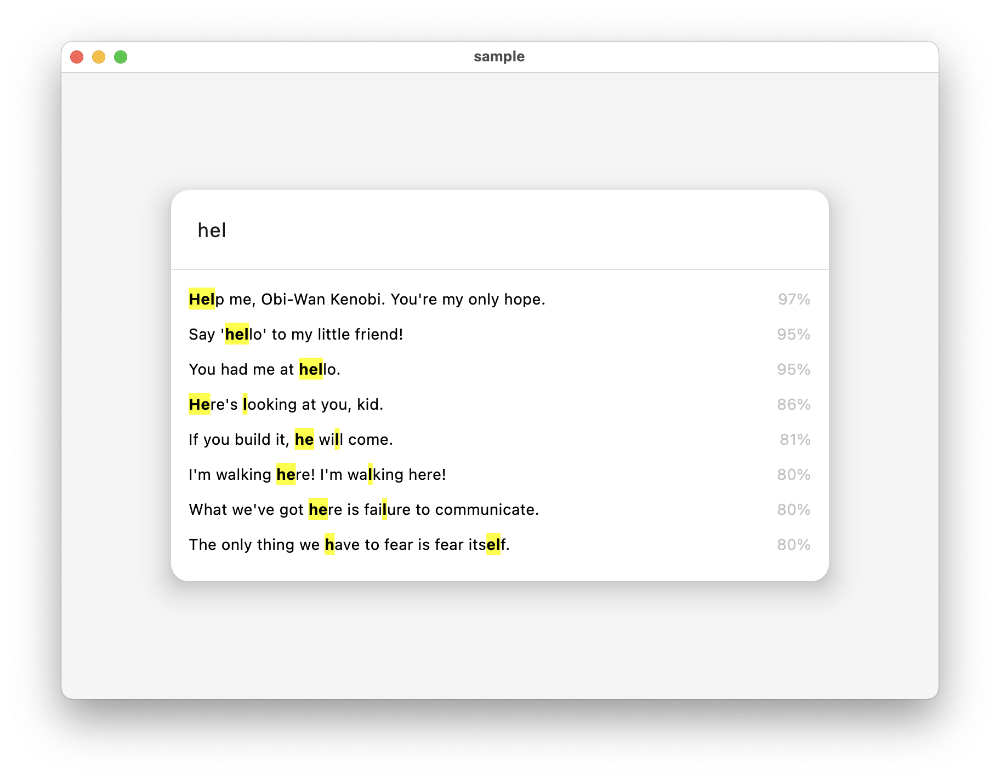

# FuzzyKot

Fuzzy string matching for Kotlin Multiplatform.



**Web demo:** https://github.com/terrakok/FuzzyKot

## Usage

FuzzyKot provides extension functions for `String` and `Collection<T>` for easy fuzzy matching and extraction.

### Simple Ratio
Calculates a simple Levenshtein distance ratio between two strings.

```kotlin
"this is a test".ratio("this is a test!") // 97
```

### Partial Ratio
Finds the best match of the shorter string within the longer one.

```kotlin
"this is a test".partialRatio("this is a test!") // 100
```

### Token Sort Ratio
Tokens are split, sorted alphabetically, and then joined back to compare. This handles different word orders.

```kotlin
"fuzzy wuzzy was a bear".tokenSortRatio("wuzzy fuzzy was a bear") // 100
```

### Token Set Ratio
Handles differences in token sets by comparing intersection and symmetric difference. This is robust against duplicate tokens.

```kotlin
"fuzzy was a bear".tokenSetRatio("fuzzy fuzzy was a bear") // 100
```

### Weighted Ratio
Combines multiple algorithms with specific weights to give a better overall score.

```kotlin
"The quick brown fox jumps over the lazy dog".weightedRatio("The quick brown fox jumps") // 60
```

### Matching Ranges
Finds matching blocks between two strings. Useful for highlighting matching pieces in fuzzy search results.

```kotlin
"test".fuzzyMatchingRanges("this is a test!") // [10..13]
```

### Extraction
Extract the best matches from a collection of items.

```kotlin
val options = listOf("Atlanta Falcons", "New York Jets", "New York Giants", "Dallas Cowboys")

// Get the best match
val bestMatch = options.extractOne("cowboys")

// Get top N matches
val topMatches = options.extractTop("new york", limit = 2)

// Get all matches sorted by score
val sortedMatches = options.extractSorted("new york")
```

#### Custom Extraction
You can customize how items are processed and which scorer is used.

```kotlin
options.extractOne(
    query = "cowboys",
    processor = { it.uppercase() },
    scorer = { s1, s2 -> s1.ratio(s2) },
    cutoff = 60
)
```

## Setup

```kotlin
implementation("com.github.terrakok:fuzzykot:[todo]")
```

## License

MIT License

Copyright (c) 2026 Konstantin Tskhovrebov

Permission is hereby granted, free of charge, to any person obtaining a copy
of this software and associated documentation files (the "Software"), to deal
in the Software without restriction, including without limitation the rights
to use, copy, modify, merge, publish, distribute, sublicense, and/or sell
copies of the Software, and to permit persons to whom the Software is
furnished to do so, subject to the following conditions:

The above copyright notice and this permission notice shall be included in all
copies or substantial portions of the Software.

THE SOFTWARE IS PROVIDED "AS IS", WITHOUT WARRANTY OF ANY KIND, EXPRESS OR
IMPLIED, INCLUDING BUT NOT LIMITED TO THE WARRANTIES OF MERCHANTABILITY,
FITNESS FOR A PARTICULAR PURPOSE AND NONINFRINGEMENT. IN NO EVENT SHALL THE
AUTHORS OR COPYRIGHT HOLDERS BE LIABLE FOR ANY CLAIM, DAMAGES OR OTHER
LIABILITY, WHETHER IN AN ACTION OF CONTRACT, TORT OR OTHERWISE, ARISING FROM,
OUT OF OR IN CONNECTION WITH THE SOFTWARE OR THE USE OR OTHER DEALINGS IN THE
SOFTWARE.

